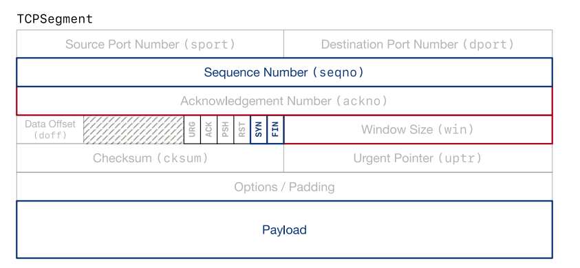
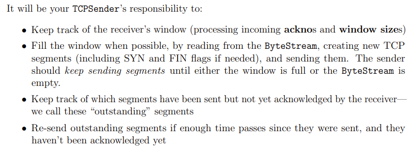

# 简介

接收receiver传来的信息，向receiver组织发送TCP Segment。

<figure><figcaption>
TCP Segment
</figcaption></figure>

红色部分为sender需要关注的部分，蓝色的部分为sender需要写入发送的部分。

<figure><figcaption>
TCPSender
</figcaption></figure>

