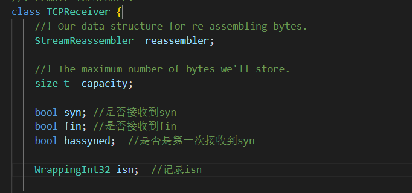

# Implementing the TCP receiver

TCPReceiver用来接收数个segment，并根据seqno组织segment，将segment中的data输入保存到StreamReassembler中。

#### 成员变量

<figure><figcaption></figcaption></figure>

#### void TCPReceiver::segment\_received(const TCPSegment \&seg)

使用此函数接收segment，在未收到syn时，会反复等待收到syn信号，在收到syn信号之后才会开始写入数据。在第一次收到syn时可以写入data，stream index为0，在后续收到seqno 为 isn即absolute seqno为0时，不写入。（absolute seqno 为0时不存在stream index）

#### ackno

返回下一个未assemble的字符的absolute seqno，正常情况下为StreamReassembler中的index+1，在已输入全部字符，输入结束的时候，应该为fin对应的absolute seqno，这时应该为index + 2；

#### window\_size

指导书中定义为 ：distance between the “first unassembled” index (the index corresponding to the ackno) and the “first unacceptable” index.也就是StreamReassembler中还能再接收的字符串的大小。
