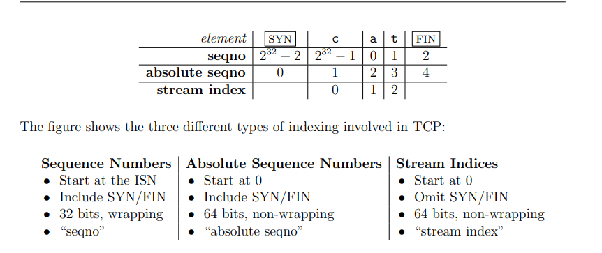

# Translating between 64-bit indexes and 32-bit seqnos

转化32位的seqno和64位的absolute seqno 、stream index。

<figure><figcaption></figcaption></figure>

#### wrap函数

将absolute seqno转化为seqno。

保留n的低32位，直接转化为32位n再加上isn即可。

#### unwrap函数

将32位seqno转化为64位absolute seqno,通过与isn比较得到absolute seqno的可能值之一，在这个数上加上n个2^32，使得其值与checkpoint最为接近，使用这个值作为转化到的值。
