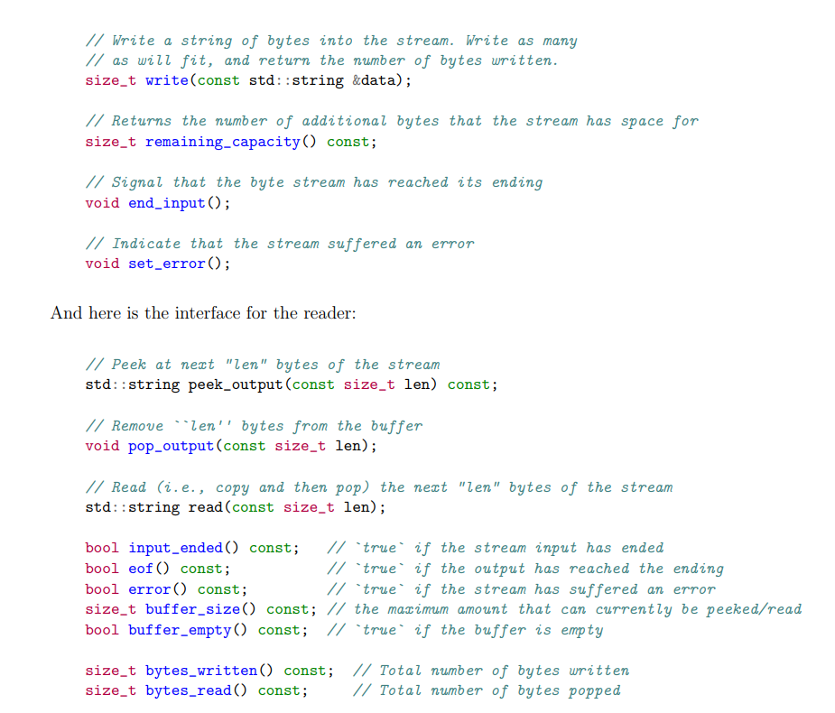

# 实现

## 类及成员

<figure><figcaption>
ByteStream_Function
</figcaption></figure>

<figure><figcaption>
piece
</figcaption></figure>

<figure><figcaption>
StreamAssembler
</figcaption></figure>

需要注意类成员包含指针时需要重载赋值运算符。

## 辅助函数

#### findprev

给定一个index,用来找到最后一个index小于该index的piece，若不存在index比该index小的piece，则返回piece的头节点。

#### shrinkpiece

给定一个piece \*p，从该piece开始向后收缩。收缩过程：\
首先往后找被p覆盖的piece，用np表示p->next，即找p->r >= np->r,（r表示piece最后一个字符的index），若覆盖，则直接删掉np，\_count减去np->cnt，并继续往后寻找，可能找到多次。

之后找与p相交或刚好邻接的piece，即找p->r + 1 >= np->l，若找到，删除重复的字符并将两个piece合并，我采取的合并方式为将np添加给p并删掉np。最多找到一次。

第一种情况判断条件上也满足第二种情况，两种处理方式略有不同，也可写在一起。

#### shrinktail

从后往前收缩，当总字符数量超过capacity时，从piece链表尾开始遗弃字符，直到字符总数小于capacity；若删掉了所有的piece则tail改为nullptr;

将iseof变为false，因为此函数从字符串末尾开始收缩，eof会被遗弃，所以iseof要重置为false。

#### 对最前的piece中的字符与ByteStream重叠的处理

未写成函数，在每次插入piece后进行这段处理。细节在后文解释。

## push\_substring实现

#### eof处理

在接收到(data,index,eof)后，首先判断data是否为空串，若为空串则则只需进行eof处理。无需进行后续处理。

若eof为真，则置iseof为真；若为假，则不做操作。因为接收到的流时乱序的，可能在之前已经接收到了eof为真的流。而是否调用end\_input结束向ByteStream的输入取决于iseof和\_count是否为0，在每次完成push\_substring操作的最后，若\_count为0且iseof为真则end\_input。

#### 未assemble字符缓存处理

先为字符流构建一个piece \*np,然后调用findprev找到应插入的位置前面的piece \*np，然后直接插入。在插入后，若np后还有piece，调用shrinkpiece(np)进行收缩处理np与后面piece重叠的情况。若p不为头节点，还需要调用shrinkpiece(p)处理p与np重叠的情况。

之后，若p为头节点，即np为最前面的piece，则需要处理np可能还和ByteStream重叠的情况，检查np->l是否小于idx，若小于则存在重叠需要去除重复的字节。若np被完全去掉则删掉np并直接返回（可能写入ByteStream的只有np）。

最后，判断当前总字符数是否超过capacity，若超过则从最后面的piece开始遗弃字符降低\_count + \_output.buffer\_size()至等于capacity。

#### ByteStream写入

若p为head则np为第一个piece，存在写入可能。在np->index == idx时进行写入，根据成功写入的数量，来删除np中保存的字符，若全删除则也需要将np删除。若np为tail则需要置tail为nullptr。

写入完成后根据\_count和iseof来决定是否调用ByteStream中的end\_input表示输入完毕。
